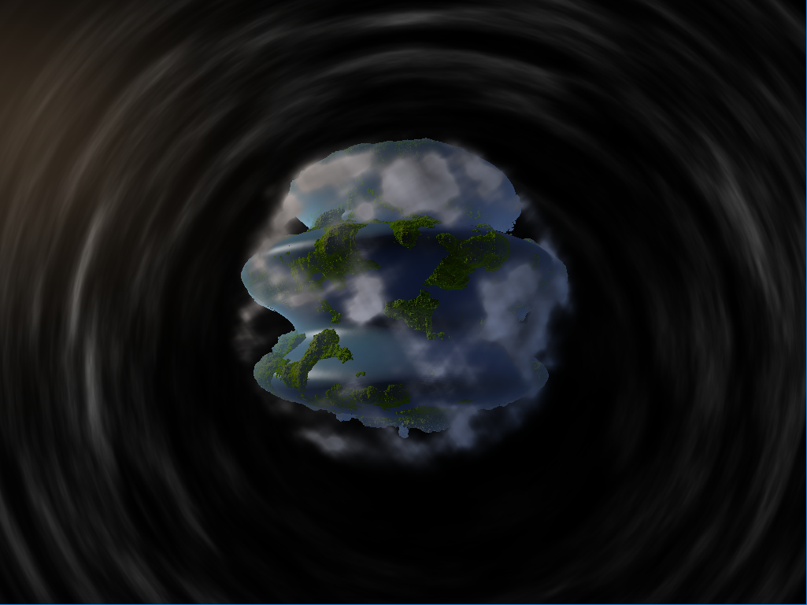
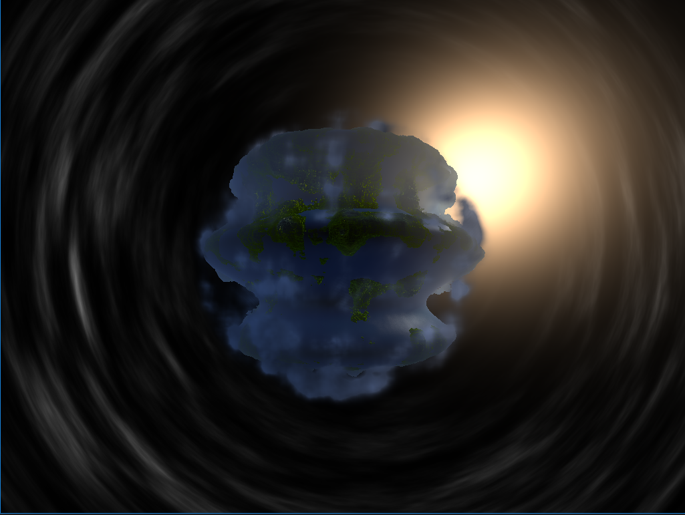
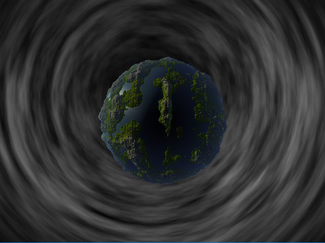

## Final Project : Demo

# Planned features / goals for final

- Every visual feature must be generated at runtime
- Multiple cameras and shots (will have camera class)
- Cloud / transparent elements
- Buildings / architectural elements
- Music, synchronization

# Checkpoint 2 Status

- Tweaked and improved coloration of the tracer.
- Simple planet deformation
- Simple sunlight coloration
- Added volumetric clouds

Need to implement the rest of the features for next time. Hoping for simple post-process. Need multiple textures in the shader. Very little time as of right now, but things open up after the last day of classes.

# Checkpoint 1 Status

- Currently a new version of my HW1 Planet
- Made a good old-fashioned OpenGL project for the raymarcher
- Raytraces on a shader to get close to the planet, then marches to finish the terrain
- Generates value noise texture at runtime, on CPU, for use in shader. Used in background and displacement

Initially I wanted to do a 4K Demo using IQ's basecode, but developing for that was a complete nightmare. 
Mariano insisted I use his basecode for a demo instead. So I cloned it then scooped absolutely everything out to make a fresh OpenGL project with glm / glew / SFML. 
Any code of his that I use is credited to him. (Currently, just some stuff for parsing and debugging shaders)