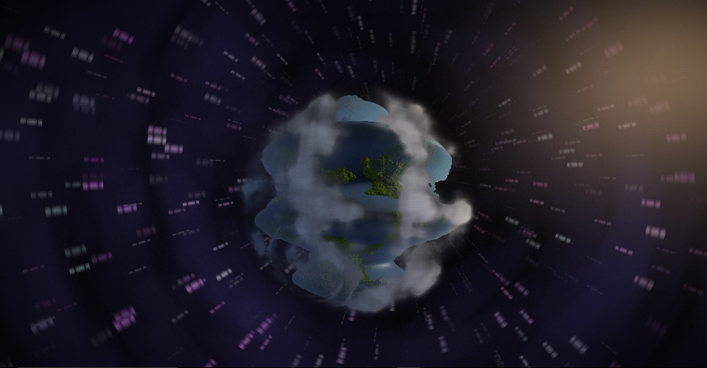
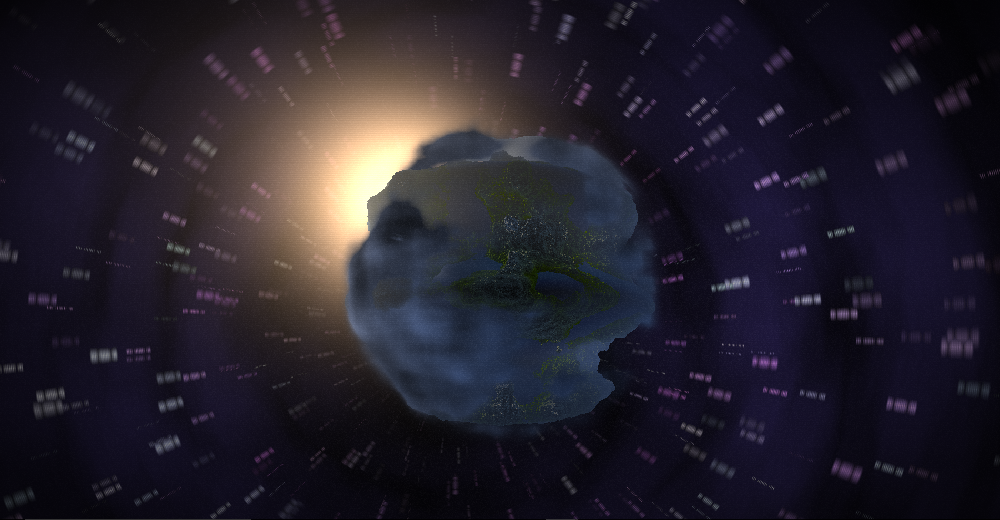

## Final Project : Demo

## Breakdown of the Final Project

# Algorithm

- Generate two pixel buffer images: perlin noise and star background
- Create the background from reading the image based on angle and distance (from center) of fragment
- Motion blur on background
- Apply sun coloration
- Raytrace to sphere
- Raymarch planet terrain from sphere
- Raymarch volumetric clouds
- Apply colors of marched objects and post processing

# Evaluations and Details

- Very happy with the results. Runs at 1080p 60fps on my laptop's GPU
- Originally planned on adding a progression with buildings popping up from the planet. But after adding the wave and synchronizing the beat, I couldn't find a way to add this without it looking bad.
- The noise on the planet and cloud are read from a baked texture. On the CPU I create 3 fractal Perlin noises and store them in , G, B channels. To read it as 3D noise, I read the channels, average them, and put them through a gain curve to even out the distribution.
- Star tunnel effect: the center moves based on a sine and cosine. I then get the angle of the fragment from the center and normalize 0 to 2PI to 0 and 1, then get the distance and sqrt it. Then mod that. Then read baked texture.
- Clouds: at each step, get density at a transformed point. Color based on density comparison with another nearby point (based on offset toward light). Density is also restricted to be 100% at some radius then tapers with distance, creating a shell
- Hurricane effect: Transformation applied to all points for the cloud. Mark some point on unit sphere, which also makes an axis. Get angle based on max(0.0, radius - pt_distance). If this is nonzero, add something based on time. Then rotate based on that axis with some noise applied.
- Sun effect: dot the ray direction with direction from origin to some point in space. Raise to some power. Then add color based on value. Also, for the planet, atmospheric color changes based on this factor.
- Terrain: simple noise effect. Varies in strength with the beat of the song. Color is based on a Cosine Palette (IQ). 
- Post is simple lines and film grain

# Acknowledgments 

- Mariano let me reset my basecode, and use an SFML installation. All code used in the demo is mine except shader loading and debugging. 
- Song used is Das Malefitz by Faunts

## Screens of Older versions

# Checkpoint 2 Status

# Checkpoint 1 Status

